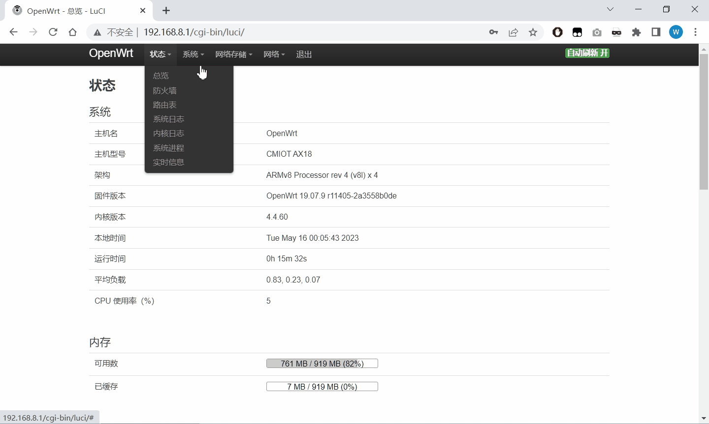

## 前言

1. 本仓库可实现https://github.com/w2xg2022/ax18usb的云编译，生成带USB驱动的和目AX18/兆能M2路由器固件。
2. 代码修改自https://github.com/P3TERX/Actions-OpenWrt，特此感谢。
3. 云编译的可调参数，请参考diy-part1.sh、diy-part2.sh。详细使用方式可参考https://p3terx.com/archives/build-openwrt-with-github-actions.html。
4. 不想看那么多信息的，直接下载<a href="https://github.com/w2xg2022/actions4ax18usb/releases/download/2023.05.16-1844/openwrt-ipq60xx-generic-cmiot_ax18-squashfs-nand-factory.ubi">openwrt-ipq60xx-generic-cmiot_ax18-squashfs-nand-factory.ubi</a>，uboot刷入即可。


## 默认信息

1. 默认IP：192.168.1.1
2. 默认管理员账号、密码：root、未设置密码
3. 默认WIFI：OpenWrt，未设置密码


## 插件清单

默认配置下的插件清单如下：



## 软件源设置

1. OPKG 基础配置

	```bash
	#option check_signature
	```

2. 发行版软件源

	```bash
	src/gz openwrt_core https://op.supes.top/targets/ipq60xx/generic/4.4.60
	src/gz openwrt_base https://op.supes.top/packages/aarch64_cortex-a53/base
	src/gz openwrt_packages https://op.supes.top/packages/aarch64_cortex-a53/packages
	src/gz openwrt_luci https://op.supes.top/packages/aarch64_cortex-a53/luci
	src/gz openwrt_routing https://op.supes.top/packages/aarch64_cortex-a53/routing
	src/gz openwrt_kiddin9 https://op.supes.top/packages/aarch64_cortex-a53/kiddin9
	```

可正常安装和运行的插件如下，其他请自行尝试；如果需要的插件确实无法顺利安装，请自行编译新的固件。

	```bash
	opkg update
	opkg install luci-app-onliner
	opkg install coremark
	opkg install luci-app-aliyundrive-webdav

	#libnl-tiny1与libnl-tiny冲突，nodeps不安装依赖即可
	opkg install luci-app-arpbind --nodeps
	```


## 已知问题

1. TTYD终端如果无法连接，在系统->启动项 重启 即可。
2. 无法支持所有U盘或外接移动硬盘，已知海力士PC711 512G外接RTL9210B移动硬盘盒，无法识别（blkid无法找到/dev/sda1）。【推荐使用FAT32格式】
	


## 打赏

如果你觉得这个仓库、说明文档和固件等对你有帮助，能够激发和目AX18/兆能M2的潜能，欢迎通过微信打赏，谢谢。


